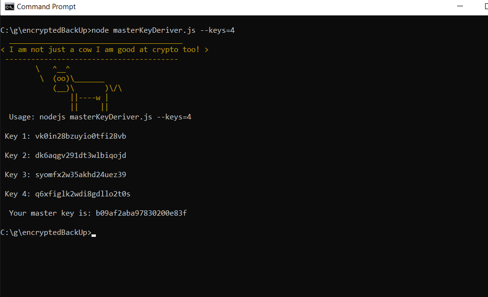

# masterKeyDeriver
A JS script that derives a master key of subkeys by XOR. 




## Usage 
```
C:\g\encryptedBackUp>node multiRoleKeyGenerator.js --keys=4
```


## Flags 
```
--keys={value} values = 2, 4, and 8.
```
